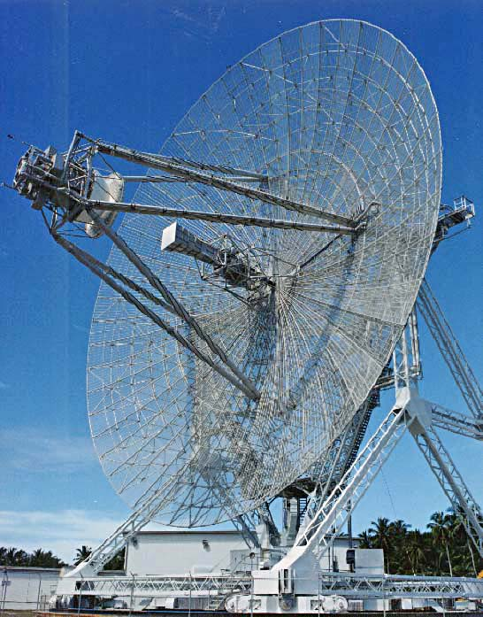

```{r setup, include=FALSE}
options(htmltools.dir.version = FALSE)
```


```{r xaringan-all, echo=FALSE, include=FALSE}
library(countdown)
library(xaringan)
library(xaringanExtra)
library(knitr)

hook_source <- knitr::knit_hooks$get('source')
knitr::knit_hooks$set(source = function(x, options) {
  x <- stringr::str_replace(x, "^[[:blank:]]?([^*].+?)[[:blank:]]*#<<[[:blank:]]*$", "*\\1")
  hook_source(x, options)
})

xaringanExtra::use_broadcast()
xaringanExtra::use_freezeframe()
xaringanExtra::use_scribble()
xaringanExtra::use_search(show_icon = TRUE, auto_search	=FALSE)
xaringanExtra::use_freezeframe()
xaringanExtra::use_clipboard()
xaringanExtra::use_tile_view()
xaringanExtra::use_panelset()
xaringanExtra::use_editable(expires = 1)
xaringanExtra::use_fit_screen()
xaringanExtra::use_extra_styles(
  hover_code_line = TRUE,         
  mute_unhighlighted_code = TRUE  
)

```
# Basic knowledge of Radar

.pull-left[
Radar (Radio Detection and Ranging) is a detection system that uses radio waves to determine the range, angle, or velocity of objects. 

Radar imaging is an active remote sensing sensor that uses electromagnetic energy backscattered from ground targets to extract physical and dielectric behavior, can be used for imaging at all times of day and in all types of weather .

( [Prakash and Kumar, 2022](https://www-sciencedirect-com.libproxy.ucl.ac.uk/book/9780128234570/radar-remote-sensing) )
]

.pull-right[
  ```{r  echo=FALSE, out.width='80%', fig.align='right'}
  
  ```
  </br>
  .pull-right[( [wikipedia.org](https://en.wikipedia.org/wiki/Radar) )]
]

---
# History of Radar 
( [hsat.space](https://hsat.space/satellites-radar-satellite-basics/#Radar_History) )

Heinrich Hertz laid the foundation for radar in 1886 by proving electromagnetic waves' existence and their reflection off metallic objects, utilizing special reflectors in his experiments. In 1904, Christian Hülsmeyer, a German high-frequency technician, advanced these findings by conducting the first radar detection experiments. Using Hertz's reflector principles, he observed that electromagnetic waves emitted and then reflected from metal surfaces could detect distant objects. Hülsmeyer invented the telemobiloscope, a device that can be used in measuring the travel time of these reflected waves, marking a significant milestone in radar technology. He patented this process on April 30, 1904, securing his place as the inventor of radar.
---
# Radar properties

( [hsat.space](https://hsat.space/satellites-radar-satellite-basics/#Radar_History) )
.panelset[
.panel[.panel-name[**Time Delay**]
  - Measures how long it takes for a reflected wave to return, indicating object distance.
]
.panel[.panel-name[**Wave Frequency Shift**]
  - Also known as the Doppler effect, where waves shift when bouncing off moving objects, revealing movement details.
]
.panel[.panel-name[**Polarisation Changes**]
  - Radio waves change polarization upon reflection (e.g., from horizontal to vertical), providing insights into object characteristics.
]
.panel[.panel-name[**Technological Evolution**]
  - Advances in technology, sensors, and computing have improved radar's effectiveness and reduced costs.
]
.panel[.panel-name[**Daily Use**]
  - Common in cruise control, automatic doors, highway monitoring, and weather forecasting.
]
.panel[.panel-name[**Satellite Radar**]
  - Radar was installed in some satellites, expanding its application range.
]
]
---

# Radar applications

Radar has seen significant civil applications for the safe travel of aircraft, ships, and spacecraft 
([Skolnik, 1962](https://helitavia.com/skolnik/Skolnik_chapter_1.pdf))


.panelset[
.panel[.panel-name[**Maritime Navigation**]
  - Ships use radar to navigate through dense fog, track other vessels, and avoid collisions, especially in busy sea lanes.
]
.panel[.panel-name[**Weather Forecasting**]
  - Precipitation patterns' motion and development can be predicted using weather radar ([AUSTIN and BELLON, 1974](https://rmets.onlinelibrary.wiley.com/doi/abs/10.1002/qj.49710042612)). Meteorologists use weather radars to detect precipitation, calculate its motion, estimate its type (rain, snow, hail, etc.), and forecast weather conditions.
]
.panel[.panel-name[**Military Applications**]
  - Originally, radar was created to meet military requirements for weapon control and observation ([Skolnik, 1962](https://helitavia.com/skolnik/Skolnik_chapter_1.pdf)). Now Radar in the military is used for surveillance, navigation, targeting, missile defense, terrain mapping, and weather monitoring to ensure operational effectiveness and personnel safety.
]
.panel[.panel-name[**Space Exploration**]
  - Spacecraft use radar to map the surface of planets and moons, determine the composition of celestial bodies, and navigate through space. For instance, Chang'E-4 Lunar Penetrating Radar reveals the thin underlying structure of the Moon's far side ([Li, 2020](https://www.science.org/doi/full/10.1126/sciadv.aay6898))
]
]
---

# Application 1.1

The radar used in space exploration, as discussed in the Chang'E-4 Lunar Penetrating Radar study ([Li, 2020](https://www.science.org/doi/full/10.1126/sciadv.aay6898)), is designed to penetrate the lunar subsurface to reveal its structure.  It operates at dual frequencies (60 MHz and 500 MHz) to image the subsurface materials.  The radar's high-frequency data provided a detailed view of the lunar farside's subsurface, identifying different geological layers and materials, including granular materials, boulders, and fine-grained deposits, aiding in understanding the Moon's geological history and structure.
---

# Application 1.2

.pull-left[
In panel A, we see a radar image (radargram) that captures what's below the lunar surface, shown as a cross-section.  It records the time it takes for radar signals to bounce back, which helps infer the depth of subsurface features. Panel B shows a tomographic reconstruction, which is like an X-ray image of the Moon's subsurface. Colors show different levels of reflectivity: red areas reflect more radar signal (suggesting different materials), while blue areas reflect less.
.

( [Li, 2020](https://www.science.org/doi/full/10.1126/sciadv.aay6898) )
]

.pull-right[
  ```{r  echo=FALSE, out.width='120%', fig.align='right'}
  knitr::include_graphics('./week2_application1.png')
  ```
  </br>
  .pull-right[([Li, 2020](https://www.science.org/doi/full/10.1126/sciadv.aay6898))]
]

---

# Application 2

The document outlines the use of radar to measure sea ice drift in the ([Lund, et al.2018](https://agupubs.onlinelibrary.wiley.com/doi/full/10.1029/2018JC013769)), specifically from a shipboard marine X-band radar. This technology processes radar data to capture sub-kilometer scale velocity fields of sea ice. It shows that contrary to previous assumptions, there's only a weak correlation between sea ice drift and wind speed near the ice edge, other factors, like ocean currents, might play a more significant role in sea ice drift in these regions. The radar's high-resolution data are validated against other measurements, and its detailed sea ice velocity fields help to understand the dynamics of sea ice, particularly in areas where it's free-floating and subject to diverse environmental forces.

---

# Application reflection

The first literature outlines how radar is used in moon exploration to detect the subsurface structure of the moon's farside, while the second one showed the application of marine X-band radar for tracking Arctic sea ice drift from a ship. Both highlight the crucial role of radar in remote sensing and the extraction of environmental data. The lunar radar provides insights into geological history, while the marine radar offers real-time, high-resolution tracking of sea ice, emphasizing the technology's adaptability in different contexts and background.

---

# Learning reflection

My study reflects the exploration of radar technology, from its fundamental principles to its applications. I've learned the history of radar, understanding its evolution from Hertz's foundational experiments to Hülsmeyer's pioneering inventions. I’ve also noticed the critical properties of radar, like time delay, wave frequency shift, as well as polarisation changes.

I’ve explored radar's crucial role in modern navigation, meteorology, military surveillance, and space exploration. For instance, learning about the Chang'E-4 Lunar Penetrating Radar illuminates how radar penetrates celestial surfaces, which is key to geological formations and processes. Similarly, shipboard marine radar's capacity to measure sea ice drift, highlighted the importance of understanding environmental dynamics and the potential influence of ocean currents.

This exploration has inspired me a recognition of multifunction of radar and its powerful impact. And I am now more and more interested in remote sensing and the knowledge of sensors.

---

# References

https://en.wikipedia.org/wiki/Radar

https://hsat.space/satellites-radar-satellite-basics/#Radar_History


Prakash, B. & Kumar, S. (2022) “Chapter 14 - Emerging techniques of polarimetric interferometric synthetic aperture radar for scattering-based characterization,” in Radar Remote Sensing. [Online]. Elsevier Inc. pp. 259–285.


AUSTIN, G. & BELLON, A. (1974) The use of digital weather radar records for short-term precipitation forecasting. Quarterly journal of the Royal Meteorological Society. [Online] 100 (426), 658–664.

Skolnik, M. I. (Merrill I. (1962) Introduction to radar systems / M. I. Skolnik. McGraw-Hill.

Li, C. et al. (2020) The Moon’s farside shallow subsurface structure unveiled by Chang’E-4 Lunar Penetrating Radar. Science advances. [Online] 6 (9), eaay6898–eaay6898.

Lund, B. et al. (2018) Arctic Sea Ice Drift Measured by Shipboard Marine Radar. Journal of geophysical research. Oceans. [Online] 123 (6), 4298–4321.

